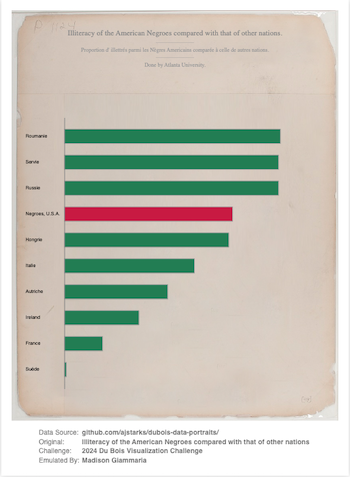
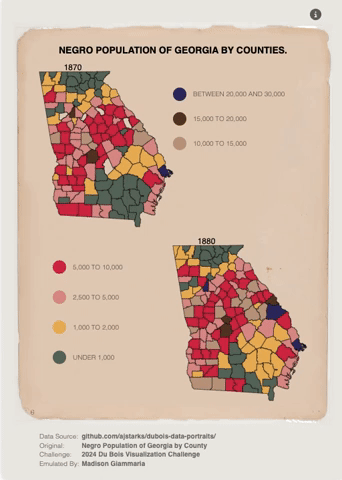

# Du-Bois-DVS-challenge
 
<small>(Photo Above) W.E.B. Du Bois at the 1900 Paris Exposition. (Chronicling America: Historic American Newspapers/Library of Congress)</small>
 
 
This repository contains my participation in [the Du Bois Data Visualization Society Challenge](https://www.datavisualizationsociety.org/news/2024/2/2/advance-your-data-viz-skills-with-the-weekly-2024-du-bois-visualization-challenge). The goal of the challenge is to celebrate the data viz legacy of [W.E.B Du Bois](https://en.wikipedia.org/wiki/W._E._B._Du_Bois)—a Black American civil rights activist, sociologist and writer—by recreating the visualizations from the 1900 Paris Exposition using modern tools. 
Visit [Github](https://github.com/ajstarks/dubois-data-portraits/blob/master/challenge/2024/README.md) for full details of each week’s challenge, including the 1900 original plates and the corresponding dataset.

## 2024 Challenge 07
 
Tool used: [Vega](https://vega.github.io/vega/docs/)

- [See the interactive version in the Vega Editor](https://vega.github.io/editor/#/gist/c7832bb3829f491bf6f5dee70828be9f/spec.json/view)
- [See the original.](2024/challenge-07/_artifacts/original-plate-47.jpg)
- [See the Vega specification.](2024/challenge-07/visualization.vg.json)

## 2024 Challenge 06
 
Tool used: [Vega](https://vega.github.io/vega/docs/)

- [See the interactive version in the Vega Editor](https://vega.github.io/editor/#/gist/faf417541a038324c3ed819bf0b58ff9/spec.json/view)
- [See the original.](2024/challenge-06/_artifacts/original-plate-54.jpg)
- [See the Vega specification.](2024/challenge-06/visualization.vg.json)

## 2024 Challenge 05
 
Tool used: [Vega-Lite](https://vega.github.io/vega-lite/)

- [See the interactive version in the Vega Editor](https://vega.github.io/editor/#/gist/bf31bbe6b86673714a636084cb6b7979/spec.json/view)
- [See the original.](2024/challenge-05/_artifacts/original-plate-13.jpg)
- [See the Vega specification.](2024/challenge-05/visualization.vl.json)

## 2024 Challenge 04
 
Tool used: [Vega](https://vega.github.io/vega/docs/)

- [See the interactive version in the Vega Editor](https://vega.github.io/editor/#/gist/bfd2250cf0790916ff1edac73f5dca2e/spec.json/view)
- [See the original.](2024/challenge-04/_artifacts/original-plate-01.jpg)
- [See the Vega specification.](2024/challenge-04/visualization.vg.json)

## 2024 Challenge 03
 
Tool used: [Vega-Lite](https://vega.github.io/vega-lite/)

- [See the interactive version in the Vega Editor](https://vega.github.io/editor/#/gist/01f767da1f5c7c8bb789b7f24c732e9b/spec.json/view)
- [See the original.](2024/challenge-03/_artifacts/original-plate-19.jpg)
- [See the Vega specification.](2024/challenge-03/visualization.vl.json)

## 2024 Challenge 02
 
Tool used: [Vega](https://vega.github.io/vega/docs/)

- [See the interactive version in the Vega Editor](https://vega.github.io/editor/#/gist/d29a1f44deaae65dc42cf4ff1d2e8589/spec.json/view)
- [See the original.](2024/challenge-02/_artifacts/original-plate-12.jpg)
- [See the Vega specification.](2024/challenge-02/visual.vg.json)

## 2024 Challenge 01
 
Tool used: [Vega](https://vega.github.io/vega/docs/)

- [See the interactive version in the Vega Editor](https://vega.github.io/editor/#/gist/b0155f3b8ed0f4d21a502bc19e424d67/spec.json/view)
- [See the original.](2024/challenge-01/_artifacts/original-plate-06.jpg)
- [See the Vega specification.](2024/challenge-01/visual.vg.json)